# Layouts Adicionales

### 01. GRID-FLOW-DENSE
Optimiza el espacio de la cuadrícula, permite que los elementos pequeños alteron su orden original para rellenar los espacios en blancos dejados por las tarejas mas grandes

- Vista de PC
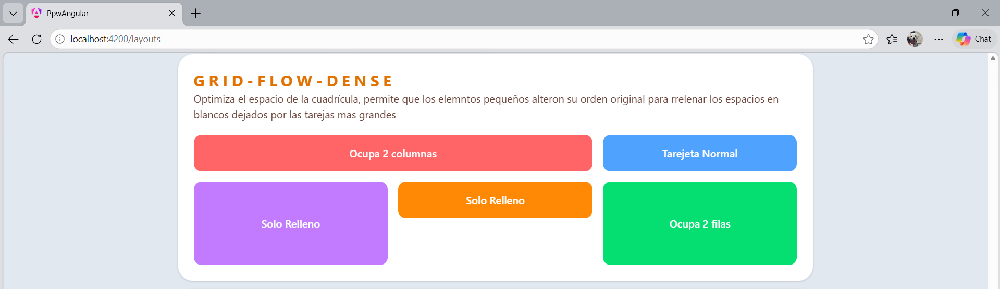
 - Vitsa de dispositivo Movil
 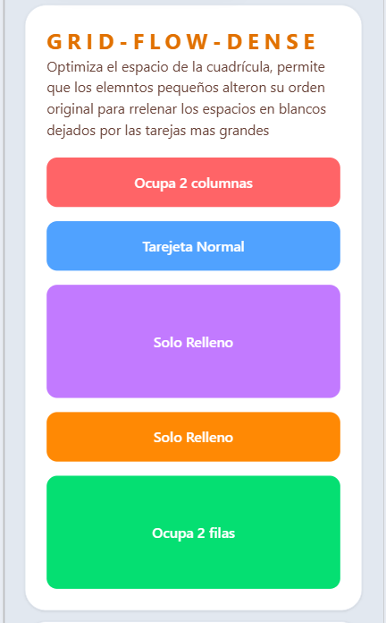

### 0.2 FLEX BASIS
Define el tamaño inicial de un elemento flex. Combinado con flex-wrap y grow, crea distribuciones fluidad y asimétricas sin usar Grid.
- Vista de Pc
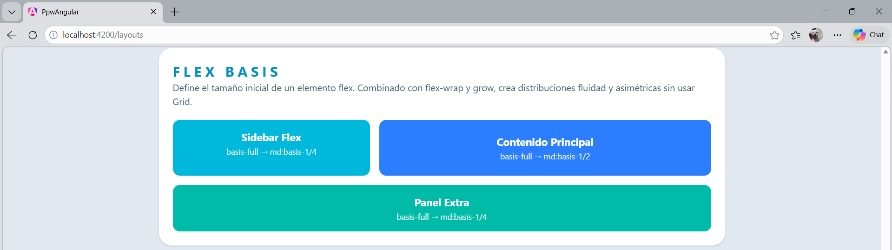
- Vista de dispositivo Movil
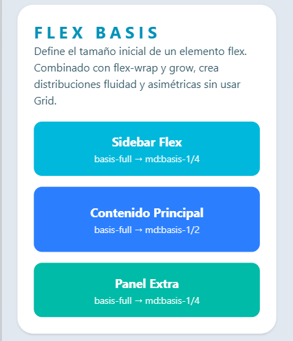

### 0.3 GRID COLUMN (SPANS)
Controla el tamaño horizontal específico de cada tarjeta y su posiciónde inicio en la cuadricula. Es la herramienta clave para romper la simetría y diseñar Layouts modernos tipo "BentoBox".
- Vista de PC
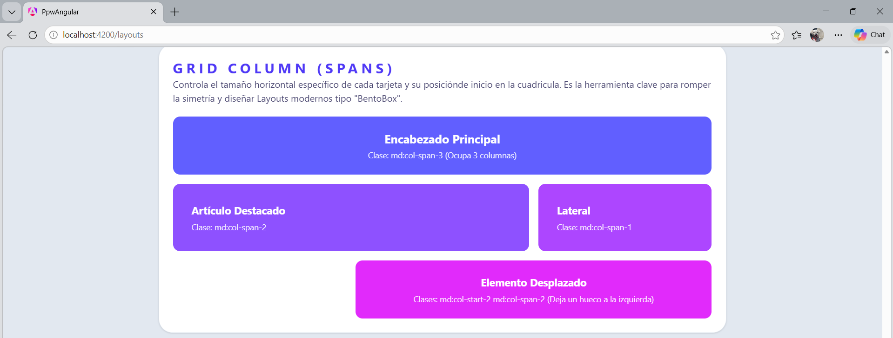

- Vista de dispositivo Movil
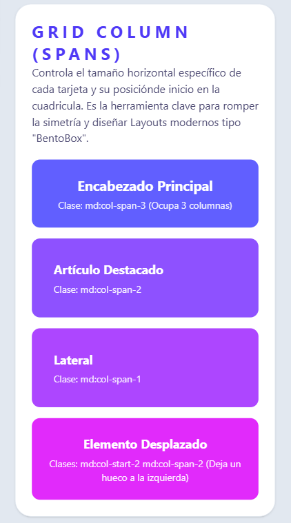

### 0.4 GRID TEMPLATE COLUMNS (AUTO-FIT)
Define el ancho exacto y la cantidad de columnas. Usando la técnica avanzada de "auto-fit" y "minmax", la cuadrícula es mágicamente responsiva sin usar prefijos como md: o lg:.
- Vista de PC

- Vista de dispositivo Movil
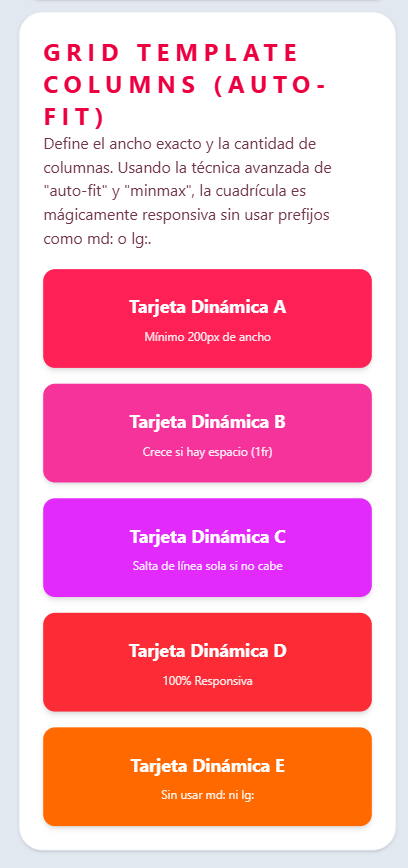

# Parctica 05
### 01.  formulario donde se muestre todos los errores
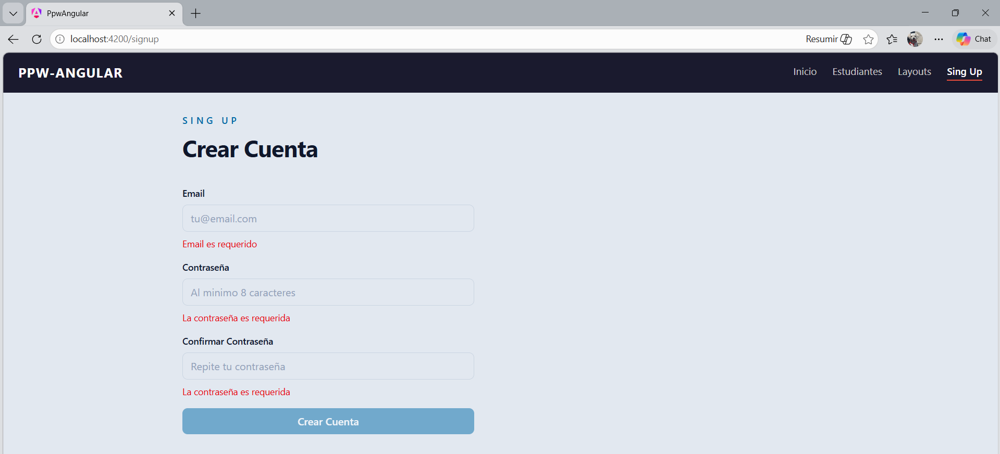
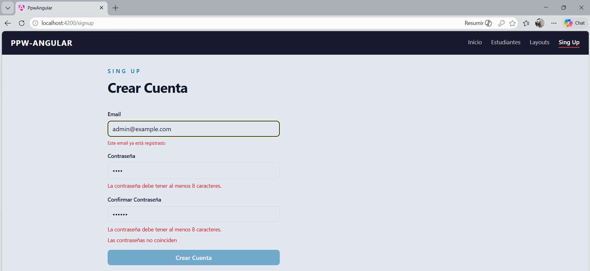

### 02. input email con el error de la valicación asincrona
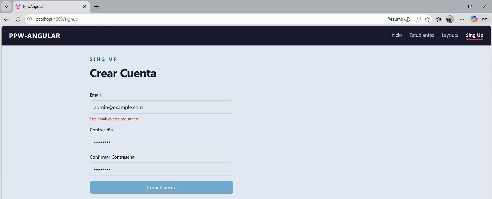

# Practica 05 B

### 0.1 formulario vacío mostrando el estado inicial
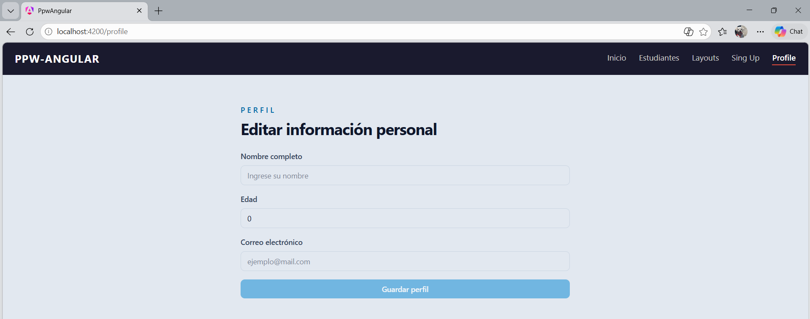

### 0.2 formulario con todos los errores visibles (después de submit)
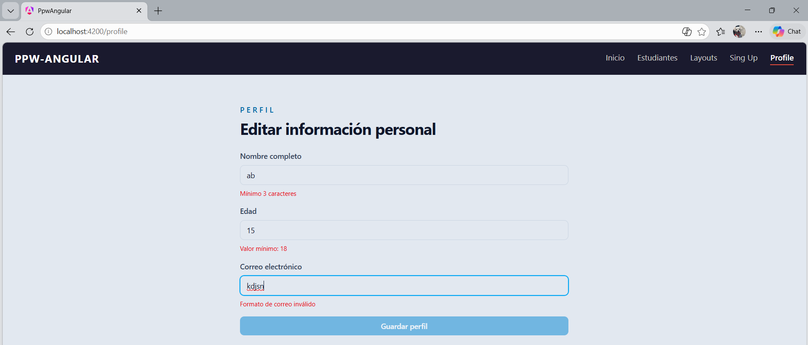

# Prcatica 5 C

### 0.1 formulario vacío/inicial
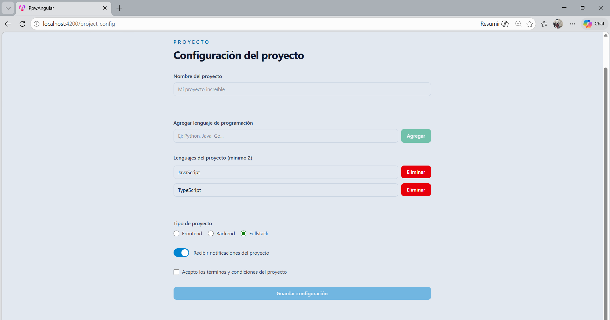

### 0.2  mostrando todos los errores de validación
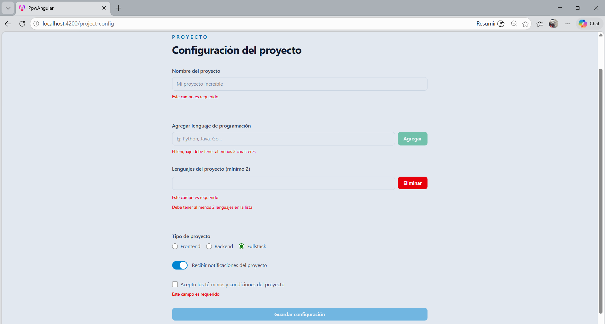

### 0.3 formulario válido y datos completos
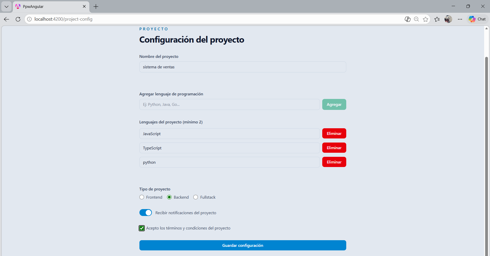

### 0.4 consola con el objeto `myForm.value` al hacer submit
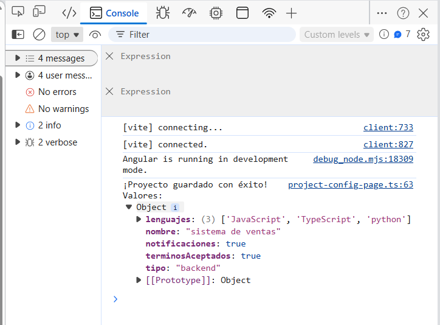